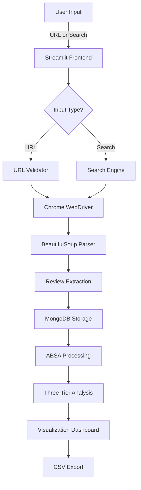

# 🚀 Myntra Review Scraper & ABSA Analysis

<div align="center">


[](https://www.python.org/downloads/release/python-3100/)
[](https://streamlit.io/)
[](https://www.mongodb.com/atlas/database)
[](https://www.selenium.dev/)
[](https://www.nltk.org/)
[](https://huggingface.co/transformers/)

**Advanced E-Commerce Review Mining with AI-Powered Sentiment Analysis**

</div>

## 🔮 Project Overview

The **Myntra Review Scraper & ABSA Analysis** is a cutting-edge web application that transforms how businesses understand customer feedback. Using a multi-tiered AI system, it extracts, analyzes, and visualizes product sentiment across multiple dimensions—delivering actionable insights for product improvements and marketing strategy.

<details>
<summary><b>✨ Key Features</b></summary>

- **🕸️ Intelligent Web Scraping**: Automated review extraction from Myntra product pages
- **🧠 Three-Tier Sentiment Engine**: VADER + TextBlob + Transformers for comprehensive analysis
- **🎯 Aspect-Based Sentiment Analysis**: Detects product aspects (quality, fit, price, etc.)
- **📊 Interactive Visualizations**: Real-time dashboards with Plotly charts
- **💾 MongoDB Integration**: Cloud database for persistent storage and retrieval
- **🔄 Two Scraping Methods**: Direct URL or search-based product discovery
- **📱 Responsive UI**: Mobile and desktop-friendly Streamlit interface
- **🔍 Smart Product Detection**: Automatic extraction of product names from URLs
- **📤 Export Capabilities**: Download results as CSV for further analysis

</details>

## ⚡ Live Demo
Since It is a WebScraper Tool , Used Webdriver and many library which will not work at deployment , so You have to Use it on Your Own machine

## 🏗️ System Architecture

>

### 🔄 Complete Data Flow

The application follows a sophisticated pipeline architecture:



### 🧠 ABSA Analysis Engine

The ABSA system performs multi-layered sentiment analysis through:

1. **Base Layer**: VADER lexicon-based sentiment scoring (75% accuracy)
2. **Enhanced Layer**: TextBlob + VADER hybrid analysis (80% accuracy)
3. **Advanced Layer**: Transformer models for context-aware analysis (90%+ accuracy)

## 🛠️ Technology Stack

<table>
<tr>
<td>

### Frontend
- **Streamlit**: Interactive web interface
- **Plotly**: Data visualization
- **HTML/CSS**: Custom styling

### Backend
- **Python 3.10**: Core language
- **Selenium**: Dynamic web scraping
- **BeautifulSoup4**: HTML parsing
- **ChromeDriver**: Browser automation

</td>
<td>

### Data Processing
- **Pandas**: Data manipulation
- **NumPy**: Numerical computing
- **NLTK**: Natural language processing
- **TextBlob**: Sentiment analysis
- **HuggingFace Transformers**: Advanced NLP

### Storage
- **MongoDB Atlas**: Cloud database
- **database-connect**: Custom connector

</td>
</tr>
</table>

## 🚀 Getting Started

### Prerequisites

- Python 3.10+
- Chrome browser
- MongoDB account (optional for full functionality)

### Installation

1. **Clone the repository**

```bash
git clone https://github.com/anand9752/review-scrapper-main.git
cd review-scrapper-main
```

2. **Create & activate a virtual environment**

```bash
# Using venv
python -m venv myvenv
# Windows
myvenv\Scripts\Activate.ps1
# Mac/Linux
source myvenv/bin/activate
```

3. **Install dependencies**

```bash
pip install -r requirements.txt
```

4. **Setup MongoDB (Optional)**

Create a `.env` file with your MongoDB connection string:

```
MONGODB_URL_KEY=mongodb+srv://<username>:<password>@<cluster>.mongodb.net/
```

5. **Run the application**

```bash
streamlit run app.py
```

6. **Access the web interface**

Open your browser and navigate to [http://localhost:8501](http://localhost:8501)

## 📊 Usage Examples

### 1. URL-Based Scraping

Enter a Myntra product URL to analyze reviews:

```
https://www.myntra.com/shirts/roadster/roadster-men-blue-solid-casual-shirt/1376577/buy
```

### 2. Search-Based Scraping

Enter a product name and select the number of products to analyze:

```
Men's Cotton Shirts
```

### 3. ABSA Analysis

After scraping, navigate to the "Generate Analysis" page to see:
- Aspect-specific sentiment breakdown
- Topic modeling of review content
- Sentiment distribution charts
- Correlation analysis between aspects
- Temporal trends in customer satisfaction

## 🧩 Project Structure

```
review-scrapper-main/
├── app.py                   # Main Streamlit application
├── requirements.txt         # Dependencies
├── .env                     # Environment variables
├── setup.py                 # Package configuration
├── docker-compose.yml       # Docker configuration
├── Dockerfile               # Container definition
├── .streamlit/              # Streamlit configuration
│   └── config.toml
├── pages/                   # Streamlit pages
│   └── generate_analysis.py # ABSA analysis page
└── src/                     # Source code
    ├── absa/                # Sentiment analysis modules
    │   ├── absa_analyzer.py
    │   ├── advanced_absa.py
    │   └── simple_advanced_absa.py
    ├── cloud_io/            # Database connectivity
    ├── constants/           # Application constants
    ├── data_report/         # Report generation
    ├── scrapper/            # Web scraping logic
    │   ├── scrape.py        # Search-based scraping
    │   └── url_scrape.py    # URL-based scraping
    └── utils/               # Utility functions
```

## 🔬 Advanced ABSA Features

<details>
<summary><b>Aspect Categories Analyzed</b></summary>

The system automatically detects and analyzes these product aspects:

| Aspect | Keywords | Description |
|--------|----------|-------------|
| **Quality/Material** | durability, material, quality, construction | Build quality and materials used |
| **Style/Design** | design, style, look, appearance, color | Aesthetic appeal and design elements |
| **Size/Fit** | size, fit, comfort, tight, loose | How well the product fits and feels |
| **Price/Value** | price, value, worth, expensive, cheap | Price-to-value assessment |
| **Delivery/Service** | delivery, shipping, packaging, service | Purchase experience aspects |

</details>

<details>
<summary><b>Sentiment Classification System</b></summary>

The ABSA engine classifies sentiments using a sophisticated scoring system:

- **Very Positive (5)**: Strong positive sentiment (score > 0.6)
- **Positive (4)**: Moderately positive sentiment (0.2 < score ≤ 0.6)
- **Neutral (3)**: Neither positive nor negative (-0.2 ≤ score ≤ 0.2)
- **Negative (2)**: Moderately negative sentiment (-0.6 ≤ score < -0.2)
- **Very Negative (1)**: Strong negative sentiment (score < -0.6)

</details>

## 📚 How It Works

The Myntra Review Scraper combines multiple advanced technologies:

1. **Web Scraping Engine**:
   - Selenium WebDriver navigates through product pages
   - Chrome browser automation handles dynamic JavaScript content
   - BeautifulSoup parses HTML structure for review extraction

2. **Database Integration**:
   - MongoDB Atlas stores scraped reviews in the cloud
   - Custom MongoDB connector handles database operations
   - Schema design optimized for ABSA queries

3. **ABSA Processing Pipeline**:
   - Natural language preprocessing (tokenization, lemmatization)
   - Aspect detection using keyword matching and NLP
   - Multi-model sentiment analysis for each aspect
   - Aggregation and visualization of results

## 🌟 Deployment Options

### Streamlit Cloud (Recommended)

1. Fork this repository to your GitHub account
2. Connect to [Streamlit Cloud](https://streamlit.io/cloud)
3. Deploy the app directly from your GitHub repo
4. Configure secrets for MongoDB connection

### Docker Deployment

```bash
docker-compose up -d
```

This will create a containerized version of the application accessible at http://localhost:8501.

### Local Development

For development purposes:

```bash
# Activate virtual environment
.\myvenv\Scripts\Activate.ps1

# Run with hot-reloading
streamlit run app.py
```

## 🛡️ Limitations & Considerations

- **Rate Limiting**: Respect Myntra's terms of service and implement delay between requests
- **Dynamic Content**: Website changes may require scraper updates
- **Chrome Dependency**: Requires Chrome browser for Selenium automation
- **Memory Usage**: Transformer models can be memory-intensive

## 🤝 Contributing

Contributions are welcome! Please feel free to submit a Pull Request.

1. Fork the repository
2. Create your feature branch (`git checkout -b feature/AmazingFeature`)
3. Commit your changes (`git commit -m 'Add some AmazingFeature'`)
4. Push to the branch (`git push origin feature/AmazingFeature`)
5. Open a Pull Request

## 📜 License

This project is licensed under the MIT License - see the LICENSE file for details.

## 📬 Contact

Anand Patidar - anand.gp.97@gmail.com

Project Link: [https://github.com/anand9752/review-scrapper-main](https://github.com/anand9752/review-scrapper-main)

---

<div align="center">
<p>Built with ❤️ by Anand Patidar</p>

⭐ Star this repo if you found it useful! ⭐
</div>
